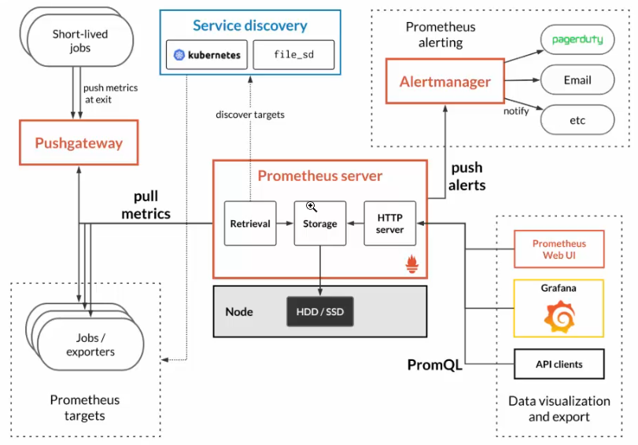

# Prometheus & Grafana - School of Net

## Seção 1: 

1. Introdução
    - Explicando o que é o Prometheus
    - <https://prometheus.io/> site do Prometheus para monitoramento.
    
2. Como funciona o Prometheus
    - Mostrando a estrutura e como funciona o Prometheus
    
    - **Prometheus Server:** Trabalha com Prometheus Targets, envia dados com `Job Exporter` com endpoints HTTP, através de um `Pushgateway` ou atraveés de `Service Discovery` esse mais atrelado ao monitoramento de métricas do Kubernetes.
    - **Alert Manager:** Serviços de alertas utilizado pelo Prometheus no qual é realizada a integração com ferramentas de alertas como o `Pagerduty` ou através de E-mail.
    - **Prometheus Web UI:**: Visualização do monitoramento através de dashboards, o Prometheus em si não é o mais recomendado para realizar o monitoramento visual por não ter uma console muito amigavel, nesse caso utilizamos o Grafana para construção de dashboards.

3. Instalando o Prometheus
    - Instalando o Prometheus em uma maquina virtual Ubuntu.
    - `useradd --no-create-home --shell /bin/false prometheus` criando um usuário para o Prometheus
    - `mkdir /etc/prometheus` e `mkdir /var/lib/prometheus` criando um diretório para armazenar os arquivos de configuração.
    - `chown prometheus:prometheus /etc/prometheus/` e `chown prometheus:prometheus /var/lib/prometheus/` concedendo permissão para o usuário do Prometheus nos diretórios criados.
    - `wget https://github.com/prometheus/prometheus/releases/download/v2.51.0/prometheus-2.51.0.linux-amd64.tar.gz` para realizar o download do instalador
    - `sha256sum prometheus-2.51.0.linux-amd64.tar.gz` realizando checksum do arquivo.
    - `tar -zxvf prometheus-2.51.0.linux-amd64.tar.gz` descompactando arquivo.
    - `cp prometheus /usr/local/bin/` e `cp promtool /usr/local/bin/` movendo arquivos executaveis para execução de qualquer contexto do sistema operacional
    - `chown prometheus:prometheus /usr/local/bin/prometheus` e `chown prometheus:prometheus /usr/local/bin/promtool` modificando permissionamento para os arquivos que acabamos de copiar para os executáveis
    - `cp -r consoles/ /etc/prometheus/` e `cp -r console_libraries/ /etc/prometheus/` copiando o diretório consoles para o diretório que criamos anteriormente.
    - `chown -R prometheus:prometheus /etc/prometheus/consoles/` e `chown -R prometheus:prometheus /etc/prometheus/console_libraries/` concedendo permissão para o usuário prometheus nas pastas que realizamos a cópia.
    - `vim /etc/systemd/system/prometheus.service` criando um arquivo de serviço para inicialização do Prometheus
    - Conteúdo do arquivo `prometheus.service`
    ```
    [Unit]
    Description=Prometheus
    Wants=network-online.target
    After=network-online.target

    [Service]
    User=prometheus
    Group=prometheus
    Type=simple
    ExecStart=/user/local/bin/prometheus \
            --config.file /etc/prometheus/prometheus.yml \
            --storage.tsdb.path /var/lib/prometheus \
            --web.console.templates=/etc/prometheus/consoles \
            --web.console.libraries=/etc/prometheus/console_libraries

    [Install]
    WantedBy=multi-user.target
    ```
    - Conteúdo do arquivo `prometheus.yml`
    ```
    global:
        scrape_interval: 15s

    scrape_configs:
        - job_name: 'prometheus'
        scrape_interval: 5s
        static_configs:
            - targets: ['localhost:9090']
    ```

4. Protegendo o Prometheus
    - Instalando o Nginx para utilizar como proxy reverso e inserir um mecanismo de autenticação
    - Instalando o pacote `apache2-utils`
    - `htpasswd -c /etc/nginx/.htpasswd son` criando um usuário **son** dentro do diretório do nginx
    - `cp /etc/nginx/sites-available/default prometheus` e `cp /etc/nginx/sites-enabled/default prometheus` para efetuar uma cópia do arquivo de configuração default
    - Editando o novo arquivo de configuração do nginx
    ```
    server {
    listen 80 default_server;
    listen [::]:80 default_server;

    root /usr/share/nginx/html;
    index index.html index.htm;

    server_name localhost;

    location / {
        auth_basic "Prometheus Server";
        auth_basic_user_file /etc/nginx/.htpasswd;
        proxy_pass http://localhost:9090;
        proxy_http_version 1.1;
        proxy_set_header Upgrade $http_upgrade;
        proxy_set_header Connection 'upgrade';
        proxy_set_header Host $host;
        proxy_cache_bypass $http_upgrade;
        }
    }
    ```
    - `ln -s /etc/nginx/sites-available/prometheus /etc/nginx/sites-enabled/prometheus` fazendo um link simbolico entre arquivos
    - `nginx -t` para verificar se o arquivo de configuração está correto

5. Instalando Node Exporter
    - <https://prometheus.io/docs/instrumenting/exporters/> exporters do Prometheus
    - `useradd --no-create-home --shell /bin/false node_exporter` criando um usuário para o node exporter
    - `wget https://github.com/prometheus/node_exporter/releases/download/v1.7.0/node_exporter-1.7.0.linux-amd64.tar.gz` baixando o node exporter para consulta de métricas do sistema operacional
    - `tar -zxvf node_exporter-1.7.0.linux-amd64.tar.gz` extraindo arquivos
    - `cp node_exporter /usr/local/bin/` copiar executavel para a pasta
    - `chown -R node_exporter:node_exporter /usr/local/bin/node_exporter` permissão para o usuário node_exporter
    - `vim /etc/systemd/system/node_exporter.service` criando um arquivo de inicialização do node exporter
    - Conteúdo do arquivo `node_exporter.service`
    ```
    [Unit]
    Description=Node Exporter
    Wants=network-online.target
    After=network-online.target

    [Service]
    User=node_exporter
    Group=node_exporter
    Type=simple
    ExecStart=/usr/local/bin/node_exporter

    [Install]
    WantedBy=multi-user.target
    ```
    - Utiliza-se a porta 9100 para coletar as métricas que ficam no path `localhost:9100/metrics`

6. Configurando o Prometheus para varrer métricas
    - Editando o arquivo do prometheus `vim /etc/prometheus/prometheus.yaml`
    - Conteúdo do arquivo:
    ```
    global:
    scrape_interval: 15s

    scrape_configs:
        - job_name: 'prometheus'
            scrape_interval: 5s
        static_configs:
            - targets: ['localhost:9090']
        
        - job_name: 'node_exporter'
            scrape_interval: 5s
            static_configs:
                - targets: ['localhost:9100']
    ```
    - Reiniciar serviço do Prometheus

7. Instalando o Grafana
    - <https://grafana.com/>
    - Inciando a instalação seguindo site
    - `sudo apt-get install -y apt-transport-https software-properties-common wget` instalando pacotes necessários
    - `mkdir -p /etc/apt/keyrings/` criando pasta para adicionar repositório do Grafana
    - `wget -q -O - https://apt.grafana.com/gpg.key | gpg --dearmor | sudo tee /etc/apt/keyrings/grafana.gpg > /dev/null` baixando a chave do repositório
    - `echo "deb [signed-by=/etc/apt/keyrings/grafana.gpg] https://apt.grafana.com stable main" | sudo tee -a /etc/apt/sources.list.d/grafana.list` adicionando repositório
    - `echo "deb [signed-by=/etc/apt/keyrings/grafana.gpg] https://apt.grafana.com beta main" | sudo tee -a /etc/apt/sources.list.d/grafana.list` adicionando repostório beta
    - `apt update` e `apt install grafana` para atualizar a lista de repositórios e instalar o Grafana
    - Quando efetuada a instalação do Grafana ele exibe logs que é necessários executar alguns comandos:
        - `sudo /bin/systemctl daemon-reload` para reiniciar os serviço
        - `sudo /bin/systemctl enable grafana-server` para habilitar o serviço do Grafana
        - `sudo /bin/systemctl start grafana-server` para iniciar o serviço
    - Porta do Grafana `3000`

8. Integrando Prometheus e Grafana
    - Usuário e senha padrão do Grafana admin>admin
    - Precisamos adicionar um source, nesse caso o Prometheus
    - Como está no mesmo servidor só colocar `http://localhost:9090` e salvar.
    - <https://grafana.com/grafana/dashboards/> dashborads do Grafana
    - Para importar um gráfico é só pesquisar e adicionar seu ID.

9. Instalando Prometheus usando Docker
    - Instalando o Docker
    - Criando um arquivo `prometheus.yaml` padrão.
    - Instalando o Docker-compose
    - Criado o arquivo `docker-compose.yaml`
    - `docker-compose up -d`

10. Instalando o Grafana usando Docker
    - Configurando o mesmo docker-composer para subir a imagem do Grafana
    - Adicionar o source como foi feito anteriormente no passo anterior.

11. Configurando o Node Exporter usando Docker
    - Configurando o mesmo docker-composer para subir um Node Exporter
    - Verificando funcionamento do Node Exporter
    - `docker logs IDCONTAINER` verificar se o Node Exporter subiu corretamente

